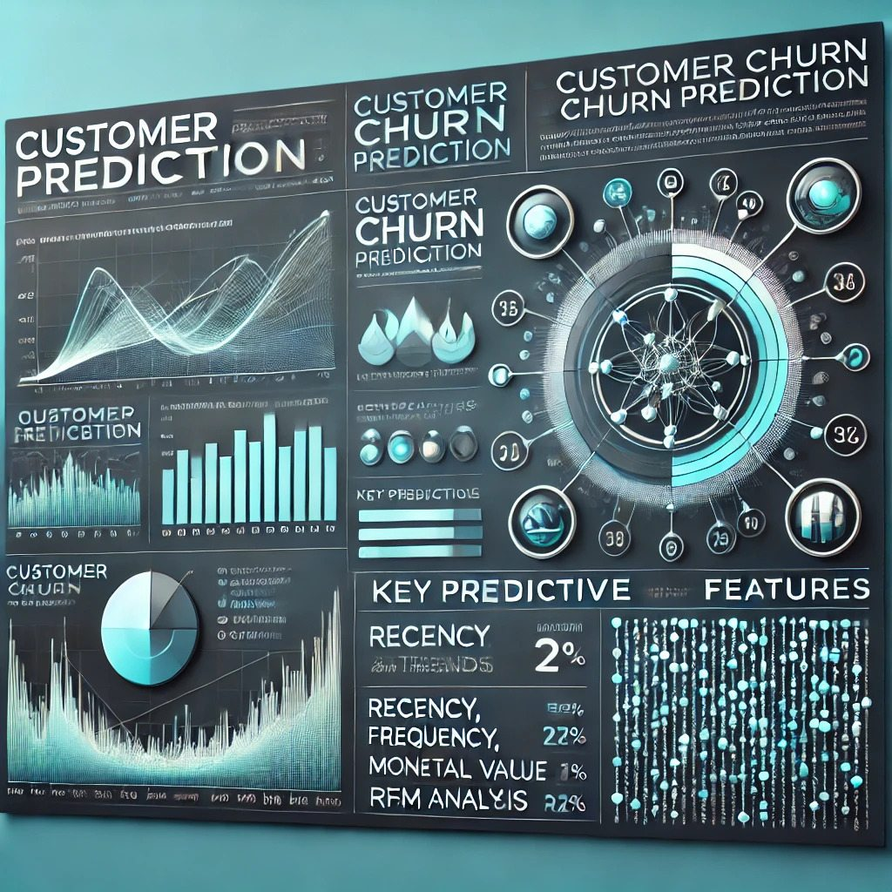
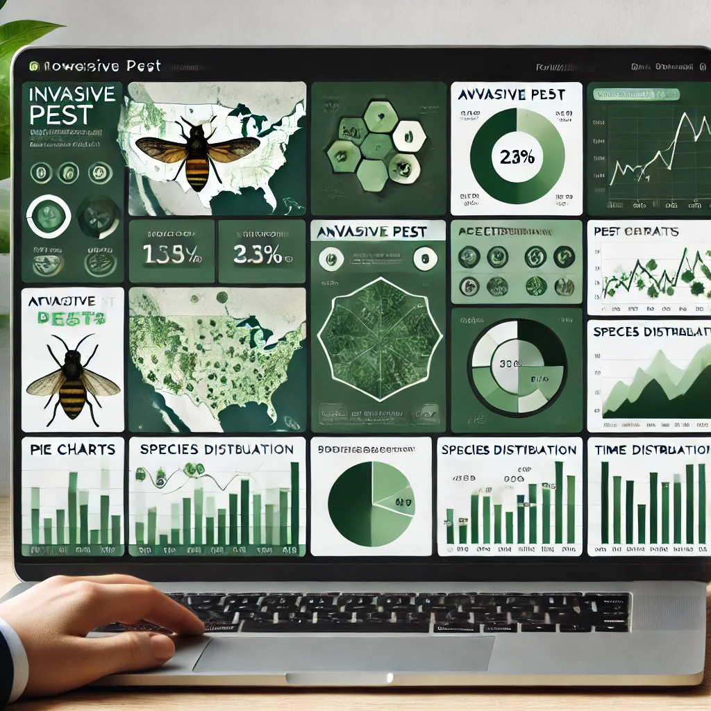
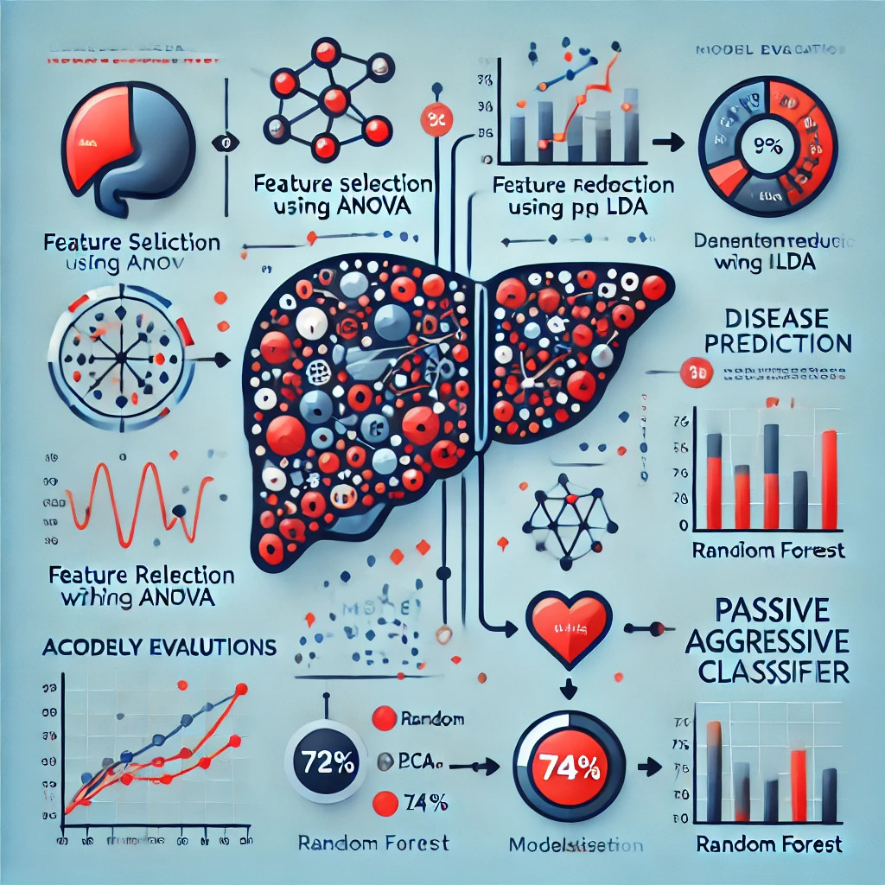

Dynamic and motivated Computer Science graduate with a strong foundation in programming, seeking a position in the software industry. Eager to apply my technical skills and knowledge gained through academic projects and internships to contribute to innovative software solutions. Committed to continuous learning and professional growth in a collaborative and dynamic environment. 

## Projects
### Customer Churn Prediction
[Project](https://github.com/AaryaniChowdaryAmbati/Customer_Churn_Prediction)

This project involves analyzing transaction data of merchants using company's payment processing services. The primary objectives are to categorize different types of businesses based on transaction patterns and predict merchant churn to inform retention strategies using machine learning algorithms

### Invasive Pest Monitoring
[Project](https://github.com/AaryaniChowdaryAmbati/Invasive_Pest_Monitoring_PowerBI)

This project involves creating an interactive dashboard to monitor and visualize the spread of an invasive insect species across multiple forest types. The dashboard integrates data from drone imagery, GPS-tagged field observations, and satellite data to provide real-time insights into affected areas. It is designed analyze pest density, spread trends, and other critical metrics.

### Liver Disease Prediction 
[Project](https://github.com/AaryaniChowdaryAmbati/Liver_Disease_Publication)

This research paper explores the use of Machine Learning (ML) techniques to predict liver disease using the Indian Liver Patient Dataset from UCI. The study applies Principal Component Analysis (PCA) and Linear Discriminant Analysis (LDA) for dimensionality reduction, followed by classifier evaluation

### Payroll System
[Project](https://github.com/AaryaniChowdaryAmbati/Payroll_System_Cert)

The online payroll system is a web application that is used to keep track of activities such as Net pay and Gross pay. The aim is to create an online payroll system that will keep track of employee information, salary, teachers, freelancers, training schedules, applicant information, payments, fees, course descriptions, records, and queries, as well as keep track of queries from advertisements and company expenditures and revenue.

### Sales analysis
[Project](https://github.com/AaryaniChowdaryAmbati/Sales-Performance-PowerBI)

This project involves the analysis and visualization of sales data for a Organisation using Power BI. The goal of this analysis is to evaluate the year-to-date (YTD) sales performance, compare it against the previous year's data (PYTD), and identify key metrics that impact profitability and sales growth. The insights provided help in making data-driven decisions for better sales and profitability management.

### Flight reviews analysis
[Project](https://github.com/AaryaniChowdaryAmbati/Flight-ratings-Tableau)

This project involves the analysis and visualization of customer reviews for Airways using Tableau. The primary objective of this dashboard is to provide a comprehensive overview of customer feedback across various metrics, including service quality, entertainment, seat comfort, and value for money. The insights derived from this analysis can help identify key areas of improvement and enhance the overall customer experience.

